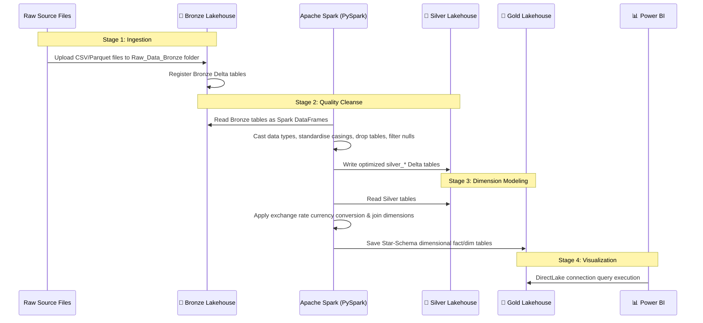

# 🏗️ Project Architecture Overview

This project implements an end-to-end modern data platform using the **Medallion Architecture (Bronze → Silver → Gold)** on **Microsoft Fabric**. It transforms high-volume, multi-currency retail transactional records into structured, high-performance analytical assets for business intelligence.

---

## 🏛️ Medallion Architecture Workflow

The system is designed to refine data progressively through three distinct layers. This approach ensures raw data preservation, clean and reliable data quality, and optimized reporting performance.

```mermaid
flowchart TD
    subgraph Data Sources
        src1[(Raw Retail CSV/Parquet Files)]
    end

    subgraph Microsoft Fabric SaaS Platform
        subgraph 🥉 Bronze Layer [Bronze Lakehouse]
            brz_files[Raw Storage Files: Raw_Data_Bronze]
            brz_tables[Delta Tables: bronze_currencyexchange, bronze_customer, etc.]
            src1 --> brz_files
            brz_files --> brz_tables
        end

        subgraph 🥈 Silver Layer [Silver Lakehouse]
            slv_notebook[PySpark Transformation Notebook]
            slv_tables[(Cleaned & Standardized Delta Tables: silver_sales, silver_customer, etc.)]
            brz_tables --> slv_notebook
            slv_notebook --> slv_tables
        end

        subgraph 🥇 Gold Layer [Gold Lakehouse]
            gld_notebook[PySpark Business Aggregation Notebook]
            gld_tables[(Dimensional Star Schema Models: fact_sales, dim_store, etc.)]
            slv_tables --> gld_notebook
            gld_notebook --> gld_tables
        end
    end

    subgraph Analytics & Reporting
        pbi_direct[Power BI Desktop / Services - DirectLake Mode]
        gld_tables --> pbi_direct
    end

    style 🥉 Bronze Layer fill:#e1d5e7,stroke:#9673a6,stroke-width:2px
    style 🥈 Silver Layer fill:#dae8fc,stroke:#6c8ebf,stroke-width:2px
    style 🥇 Gold Layer fill:#d5e8d4,stroke:#82b366,stroke-width:2px
```

---

## 💾 Layer Responsibilities

### 1. 🥉 Bronze Layer (Raw Ingestion)
*   **Purpose:** Act as the single source of truth. Raw data is stored exactly as received from operational systems without alterations.
*   **Data Format:** Delta Lake tables (schema-on-read).
*   **Engineering Rules:** 
    *   No renaming, filtering, or casting of incoming columns.
    *   Preserves full history and row structure.

### 2. 🥈 Silver Layer (Cleaned & Standardized)
*   **Purpose:** Standardize data structures, enforce schema validations, handle missing/null values, and prepare data for analytical join operations.
*   **Data Format:** Optimized Delta Lake tables.
*   **Engineering Rules:**
    *   Explicit casting of high-precision numeric values (e.g., converting `decimal(20,5)` to double).
    *   Enforcement of standard date types on timestamps.
    *   Null value filtering on essential composite keys and foreign keys.
    *   Consistent string casing standardization (e.g., using `INITCAP` on categorical columns).
    *   Dropping of irrelevant transactional columns.
    *   Implementation of simple derived measures (e.g., standardizing transactional sales amount and gross profit).

### 3. 🥇 Gold Layer (Aggregated Business Models)
*   **Purpose:** Deliver business-ready aggregated models and star-schema frameworks (fact and dimension tables) ready for consumption.
*   **Data Format:** Highly-optimized Delta Lake tables.
*   **Engineering Rules:**
    *   Multi-currency translation to convert local sales amounts to standard base reporting currencies (e.g., USD) using exchange rates.
    *   Integration of tables into standard Fact (`fact_sales`) and Dimension (`dim_customer`, `dim_product`, `dim_store`, `dim_date`) hierarchies.
    *   Pre-aggregated KPI definitions at granular time, store, and product dimensions to ensure fast dashboard performance.

### 4. 📊 Reporting Layer (Power BI Dashboards)
*   **Purpose:** Deliver interactive, responsive dashboard interfaces for business intelligence stakeholders.
*   **Compute Engine:** DirectLake mode connection directly to Gold Lakehouse tables, eliminating standard import schedules or latency delays.

---

## 🛠️ Tech Stack & Components

| Component | Technology | Role |
|:---|:---|:---|
| **Data Platform** | Microsoft Fabric | Unified SaaS data platform providing workspace isolation and integrated security |
| **Data Lake** | Microsoft OneLake | Single, unified logical data lake standardizing data access across storage layers |
| **Storage Engine** | Delta Lake (Parquet-backed) | Formats data as ACID-compliant Delta tables for transactional integrity and speed |
| **Processing Engine** | Apache Spark (Synapse PySpark) | Distributes processing compute for parallelized table transformations |
| **Language Interface** | Spark SQL / PySpark | Executes transformations, standardizations, and column derivations |
| **Business Intelligence** | Power BI (DirectLake) | Connects dashboard reports directly to storage datasets with high query performance |

---

## 🔄 End-to-End Data Flow



---

## 🔑 Key Engineering Decisions

### 1. Choosing Spark SQL inside PySpark Notebooks
*   **Decision:** The transformation logic utilizes Spark SQL temp views (`createOrReplaceTempView`) inside standard PySpark notebooks.
*   **Rationale:** Spark SQL provides clear readability for declarative data manipulation language (DML), simplifies standard calculations (like `CONCAT` and `ROUND`), and allows easy translation for analysts who work in SQL, while preserving the scalability of PySpark's memory management.

### 2. High-Precision Numeric Cast to `DOUBLE`
*   **Decision:** Re-casted all decimal fields (e.g., `UnitPrice`, `NetPrice`, `UnitCost`, and `Exchange`) originally structured as raw high-precision decimals to PySpark `DOUBLE` types in the Silver layer.
*   **Rationale:** This optimizes memory storage overhead and dramatically improves math compute speed inside distributed Spark SQL calculations without compromising reporting precision.

### 3. Preserving Product Codes as Strings
*   **Decision:** `ProductCode` was explicitly kept as a string during Bronze-to-Silver transformations instead of casting it to an integer.
*   **Rationale:** Retains leading zeroes in catalog codes (e.g., `'00125'`), preventing product key degradation and ensuring accurate cross-system catalog lookups.

### 4. DirectLake Connection Mode
*   **Decision:** Connect Power BI dashboards directly to the Gold Lakehouse Delta tables using **DirectLake** mode.
*   **Rationale:** Combines the performance of Import Mode (caching tables in memory) with the real-time nature of DirectQuery, removing the overhead of setting up and scheduling dashboard refreshes.
